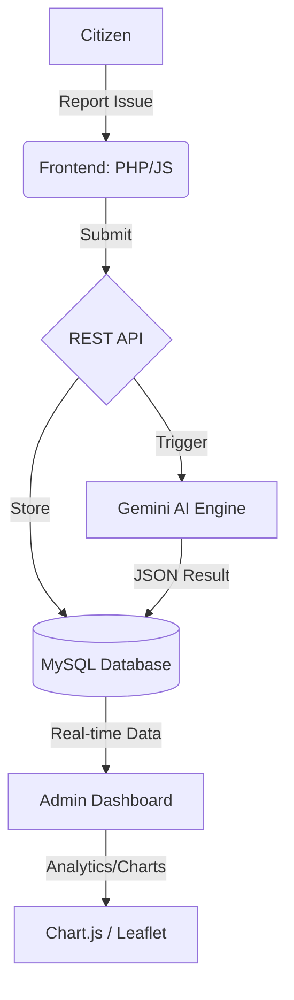

# civicshield-ai
AI-powered civic infrastructure monitoring and analytics platform

# 🛡️ CivicShield AI

**AI-powered civic issue reporting and analytics platform built with PHP, MySQL, Gemini AI, Leaflet.js, and Chart.js.**

---

## 🎯 Overview

CivicShield AI allows citizens to report public infrastructure problems — potholes, broken streetlights, flooding, waste, structural damage — and uses Google's Gemini AI to instantly classify, score, and recommend action for every report. Authorities track everything through a real-time analytics dashboard with predictive risk simulation.

---

## 🏗️ Architecture

### System Flow


### Folder Structure
```
CivicShieldAI/
├── config/
│   └── database.php       ← PDO connection, constants, helpers
├── api/
│   ├── auth.php           ← User Session management
│   ├── report.php         ← CRUD for reports + file upload
│   ├── ai-process.php     ← Gemini AI classification engine
│   ├── analytics.php      ← Stats, charts, and predictive data
│   └── timeline.php       ← Status history retrieval
├── docs/
│   └── API_DOCUMENTATION.md ← Detailed REST API reference
├── assets/
│   ├── css/               ← Glassmorphic UI & Motion System
│   └── js/                ← Leaflet, Chart.js, & Map Modules
├── index.php              ← Citizen Homepage
├── dashboard.php          ← Enterprise Analytics Panel
└── schema.sql             ← Full Database structure
```

---

## ⚙️ Setup Instructions

### 1. Prerequisites
- XAMPP (PHP 8.1+, MySQL 5.7+, Apache)
- Gemini API Key (get one at [Google AI Studio](https://aistudio.google.com/apikey))

### 2. Configuration
1. Place the folder in `htdocs/`.
2. Edit `config/database.php` and set your `GEMINI_API_KEY`.
3. Import `schema.sql` into a MySQL database named `civicshield`.

Open: **http://localhost/CivicShieldAI/**

---

## 🧠 Intelligent Prioritization (IQ-Ranking)

CivicShield doesn't just sort by "Recent." It uses a **Weighted Ranking Algorithm** to handle emergency triage automatically:

$$Intelligent Score = BaseSeverity + (Density \times 5) + (DaysOld \times 2) + KeywordBoost$$

- **BaseSeverity (0-100)**: Assessed by Gemini AI from the report text.
- **Location Density**: Higher score if multiple unresolved issues are in the same zone.
- **Time Factor**: Reports gain urgency weight every 24 hours they remain `pending`.
- **Keyword Boost**: Critical terms like "danger", "emergency", or "hazard" trigger an immediate +15 boost.

---

## 🤖 AI Prompt Engineering

The system uses **Gemini 1.5 Flash** to perform high-fidelity triage. 

**Prompt Design:**
Gemini is instructed to act as a "Civic Infrastructure Analyst" and return a strictly structured JSON object. 
- **Classification**: Automatic sorting into six municipal categories.
- **Sentiment & Risk**: Extraction of human safety risks.
- **Actionable Steps**: Generating specific recommendations for city departments.

---

## 🔐 Security Features

- **Audit Trail**: Every status change is logged in a `report_timeline` for public transparency.
- **Security Hardening**: Anti-spam Honeypots, PDO Prepared Statements, and session-based CSRF protection.
- **Role-Based Access**: Strict separation between Citizen (Reporting) and Admin (Management) roles.

---

## 🚧 Limitations & Roadmap

### Current Limitations
- **File Uploads**: Limited to 5MB images (JPEG/PNG).
- **Map Tiles**: Requires internet connection for Leaflet tiles.
- **Geocoding**: Uses Nominatim (OSM), which has rate limits for very high traffic.

### Future Roadmap
- [ ] **Phase 18**: Citizen Reputation System (incentivize accurate reporting).
- [ ] **Phase 19**: Municipal Webhook Integration (auto-dispatch work orders).
- [ ] **Phase 20**: Mobile App (Flutter) for offline field reporting.

---

*Built for community-driven infrastructure improvement. 🌍*
